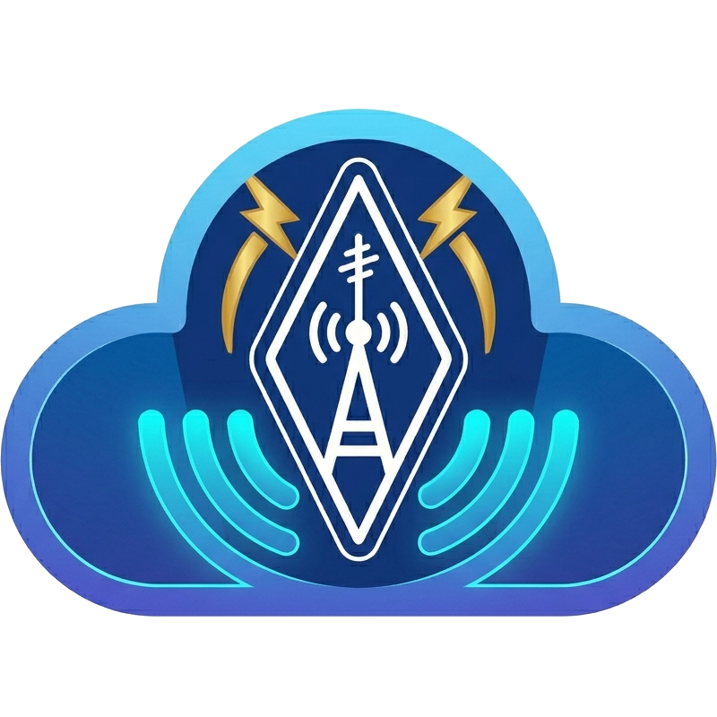

[](https://github.com/FEZ-Remote/fez-remote-signal-server/actions/workflows/ci.yaml)
# QSP



QSP is a solution to remotely operate ham radio transceiver to Internet or
local network.
The operator can connect through a web portal anywhere. Close to the
transceiver, a computer (Or a Single Board Computer) run a QSP agent application
to make the link between the hardware and the network.

This repository is described a subcomponent of the full solution.

TODO Full project documentation 

# QSP Signaling Server

The QSP signaling server is the backbone component of QSP. It allow to
connect clients and agents together.

A QSP OAuth2 signaling is required to work. A postgresql database server
is also mandatory to run a signaling server instance.

# Running this project
## From docker
Full Docker image documentation is available on Docker Hub: https://hub.docker.com/r/f4fez/qsp-signaling-server

### Requirements
- Docker
- PostgreSQL 17+

### Quick start
Start the application with:
```shell
docker run --rm \
  --name qsp-signaling-server \
  -p 9000:9000 \
  -e SPRING_DATASOURCE_URL=jdbc:postgresql://host.docker.internal:5432/qsp \
  -e SPRING_DATASOURCE_USERNAME=qsp \
  -e SPRING_DATASOURCE_PASSWORD=qsp_password \
  f4fez/qsp-signaling-server:latest
```

## From the sources
### Requirements
- Java 25+
- Maven
- Postgresql 17+

### Setup
Setup the database connection. As example by environment variable:
```
SPRING_DATASOURCE_URL=jdbc:postgresql://localhost:5432/qsp
SPRING_DATASOURCE_USERNAME=qsp
SPRING_DATASOURCE_PASSWORD=qsp_password
```

### Run
Start the application with:
```shell
mvn spring-boot:run -f pom.xml
```
